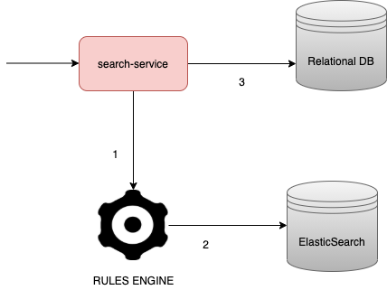
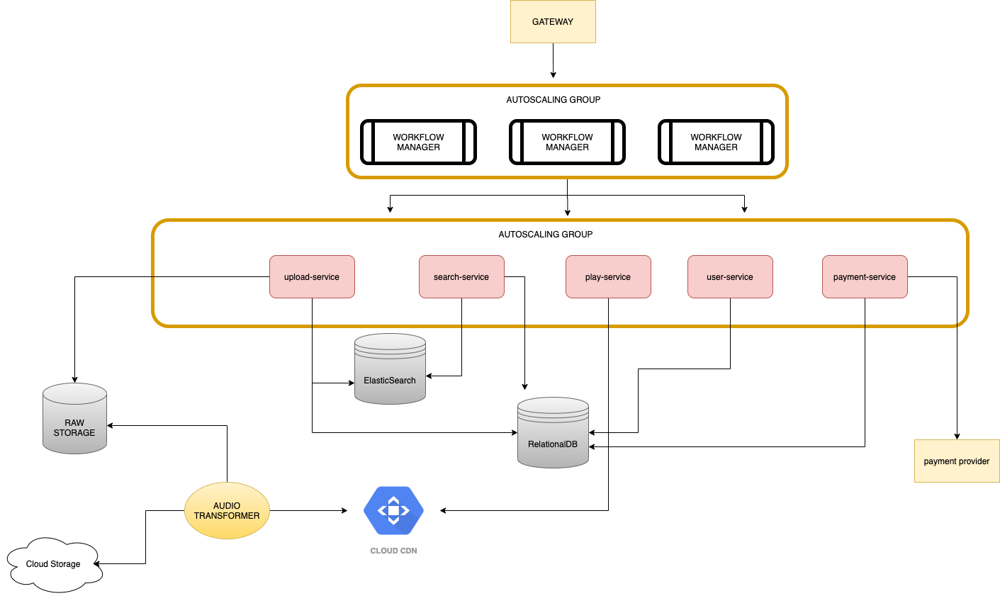

# Spotify

---

#### System design of audio streaming system - _**Spotify**_

----
### Functionalities:

- User should be able to listen to any song
- User should be able to download any song
- User should be able to choose song bitrate/quaility
- User should be able to create, follow, share playlists
- User should be able to upload a song
- User should be able to buy a song
- User should be able to upload a song
- User should be able to search for a song

#### Extended functionalities:

- We can add accout plans based on a subscription
	- Premium subscribers can listen songs without ads and with unlimited song skips.
	- The guest users have to listen through ads every third song. Also the user may skip maximum of 6 songs per hour.

---

### Load estimates
- ***100M*** active users every month

- ***12 hours*** of music uploaded every minute
   - Average song is around 4min
   - `12hours * 60min = 720min`
   - `720min / 4min = 180 songs per minute`
   - `180 songs per minute / 60 seconds = 3 songs per second`
   - Songs are uploaded in ***320kbps***
     - 320kbps per min is ***2.4 MB***
   - `720min * 2.4MB = ~1.5GB`
   - We have ***1.5 GB*** of content uploaded ***per minute***.
   - Let's estimate the load for the next 5 years;
     - `1.5GB * 643 829 minutes in a month * 12 months * 5 years = 55 petabytes`
- Average user listens *15 songs per day*
  - `100M users * 15 songs per day = 1.5 billion songs per day`
  - `1.5B / 24 hours / 60 min = 1041666 songs per minute`
  - `1041666 songs per minute / 60 seconds = ~ 17k/s`
  - Our system has ***17k*** songs played every second

  - As as conclusion:
     - WRITE: 180 songs/s
     - READ: 17 000 songs/s

   ---
   #### Upload an audio flow
	
	
	1. The upload-service will process the request for upload of an audio and send it rule engine
	2. The Rule Engine will validate if certain user may upload certain files in a certain country.
	   - after successful validation, the rule engine will delegate the file to the Raw Storage
	3. The Raw media server will store the audio file
	4. The Audio Transformer will detect that new audio file is added in the raw storage
	   - The Audio Transformer will compress the audio file and make it in three different sizes, so that the users can download/stream file of different sizes
	   - After the compression, all of the files will be uploaded to some cloud storage.
	5. The cloud storage will save the compressed files and also upload the files in CDN of a choice
	
	5.1 After the files are uploaded in a CDN, we will write the file metadata (along with CDN and CloudStorage links) to relation db.
	5.1 We will also put the audio name and id to the relation DB in ElasticSearch
	
	* the raw storage will be purged on a given interval
   
   ----
	#### Search for an audio flow
	
	
	1. The search-service will process the request for search based on a keyword and will call the Rule Engine to determine which songs must be filtered out.
	2. After Rule Engine validates the search criteria, we will retrieve the DB index of the songs that match the search criteria
	3. After we retrieve the indexes, we will use the relational DB to get specific audio metadata and the link to the audio location on the CDN.
	
	----
	#### Play audio flow
	
	
	1. The play-service will stream/download audio based on the provided url

	---
	#### How things look so far
	
	
	
	
	### What can be improved
	- Right now, the workflow manager is a single point  of failure
	- The DB is coupled with most of the services
	   - we can split the DB in two:
	      - Song Metadata DB
	      - User Metadata DB
	      - This would sacrafice a bit of performance and we will have to do sync between the two databases
	- We can cache the location of the top 100 most listened to songs  